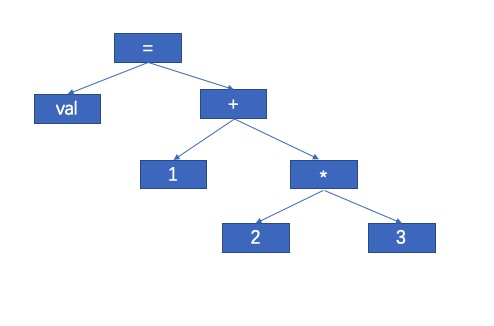
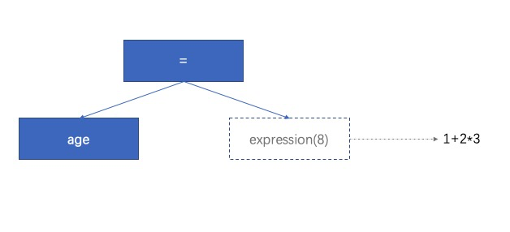

# 初探TDOP

本文不会涉及太多文法、产生式、递归下降分析等编译原理的理论知识，主要围绕Douglas Crockford关于TDOP的[讲解](https://github.com/douglascrockford/TDOP)进行思路梳理。以TDOP为切入点学习编译原理可以从侧面辅助我们更好对Babel、TS、VUE模版编译等一系列前端编译场景的理解和应用,如:

- 分析ast进行安全的插桩代码注入
- 编写自己的eslint、vuelint扩展
- ...

如果更进一步，我们可以利用TDOP来构建我们想要的任意**领域语言**，如：

- 定义自己的dsl，用编程的方式直接生成数据可视化图表或uml图   
- 构建自己的上层跨端dsl，来投放不同容器，如微信小程序、h5等   
- ...   

本文包含以下内容：
- [词法和语法](#%E8%AF%8D%E6%B3%95%E5%92%8C%E8%AF%AD%E6%B3%95)
    - [词法分析](#%E8%AF%8D%E6%B3%95%E5%88%86%E6%9E%90)
    - [构建AST](#%E6%9E%84%E5%BB%BAast)
    - [TDOP](#tdop)
- [符号和表达式](#%E7%AC%A6%E5%8F%B7%E5%92%8C%E8%A1%A8%E8%BE%BE%E5%BC%8F)
    - [符号](#%E7%AC%A6%E5%8F%B7)
    - [expression(0)](#expression0)
- [作用域和语句](#%E4%BD%9C%E7%94%A8%E5%9F%9F%E5%92%8C%E8%AF%AD%E5%8F%A5)
    - [作用域](#%E4%BD%9C%E7%94%A8%E5%9F%9F)
    - [语句](#%E8%AF%AD%E5%8F%A5)
- [扩展阅读](#%E6%89%A9%E5%B1%95%E9%98%85%E8%AF%BB)

## 词法和语法
```javascript
(function exprFn(){}) // ƒ exprFn(){}
{function stmtFn(){}} // undefined
```
当我们在chrome输入上面两行，chrome第一行输出 `ƒ exprFn(){}` ，第二行输出 `undefined` ，JS引擎是如何理解上面两行并作出不同输出的呢？要回答这个问题，需要从JS引擎如何解释执行JS源码说起。<br />在经典的编译原理中，会将编译器分为前端和后端:   

**前端**：仅与编译的源代码相关

- 词法分析(Token)
- 语法分析(Parser)
- 语义分析

**后端**：和目标语言相关

- 字节码
- 目标代码

抽离两部分是为了方便一种源代码在不同目标语言上的实现，在编译器前端部分已经完成此种语言的语法、语义的定义，所以我们要回答开头的那个问题只需关注JS编译器的前端即可。

### 词法分析
词法分析(Lexer)将源码按我们定义的编程语言规则进行分词，它输出tokens作为语法分析的输入：   
`source code --> tokens --> parser --> ast`   
如何从源代码识别出一个个"词法单元"呢？只要按照**_词法单元_**_的定义_尽可能多的消费掉源码即可识别出一个词法单元。<br />下面来看看JS引擎词法定义的简化版<br />
   

这里举个例子说明，如果有这样一段源码
```javascript
const age = 1 + 2 * 3
```

- 忽略掉源码中的空格然后从源码字符流中逐字符分析
- 遇到'c'，根据上图按"英文字母"的定义尽可能的消费掉源码，即可获得第一个词法单元 `const`，类型为 name（标识符或关键字）。
- 然后从const后的下一个非空字符开始，遇到'a',获得下一个词法单元 `age`，类型为name（标识符或关键字）。
- 继续，遇到 "=" 根据 `'<>+-&', '=>&:'` ,获得第三个_词法单元_ `=`，类型为 operator


我们可以根据词法定义构建有穷状态机来解出tokens，但是有穷自动机需要大量的回溯，所以一般的词法分析既不构建有穷状态机也不使用正则，而是通过根据词法定义简单的分析字符串流的方式来拆解出tokens<br />上面这个例子最终会生成这样的tokens结果<br />

```javascript
[
  {"type":"name","value":"const","from":7,"to":12},
  {"type":"name","value":"age","from":13,"to":15},
  {"type":"operator","value":"=","from":16,"to":17},
  {"type":"number","value":1,"from":18,"to":19},
  {"type":"operator","value":"+","from":20,"to":21},
  {"type":"number","value":2,"from":22,"to":23},
  {"type":"operator","value":"*","from":24,"to":25},
  {"type":"number","value":3,"from":26,"to":27},
]
```


### 构建AST
在有了tokens流后，如何进行语法和语义分析正确计算出1+2*3的结果并且将此表达式返回值赋值给val？
```javascript
var val = 1 + 2 * 3
```

上面的例子，如果能解析成下图的树结构，并且**自底向上按照中缀（运算符）类型的求值函数将子节点作为入参进行归并**，便可计算出1+2*3的值，然后想办法找到对应作用域的val进行赋值即可。


> 非真正ast结构


上图AST对应的json表示

```json
{
    "value": "=",
    "arity": "binary",
    "first": {
        "value": "a",
        "arity": "name"
    },
    "second": {
        "value": "+",
        "arity": "binary",
        "first": {
            "value": 1,
            "arity": "literal"
        },
        "second": {
            "value": "*",
            "arity": "binary",
            "first": {
                "value": 2,
                "arity": "literal"
            },
            "second": {
                 "value": 3,
                 "arity": "literal"
             }
         }
     }
 }
```

<br />我们如何生成这棵AST呢，当然这其中要解决很多难题：

- 优先级：虽然人能一眼看出2要先和3想乘，但如何告诉计算机'2'这个左右值要被'*'吸引和3相乘而非和1相加呢？
- 作用域：`var a = b + 1 +3`,如何理解这个b并获取对应的值
- 表达式、语句：真正的语言中并非简单的`1+2+3`这种表达式，还有复杂的语句块`if (window) { val = 'web'}`、`class BizClass {}`，这种该解析成什么样的AST？
- 算符的二义性：如+，把他理解成"加法"还是"正数"？
- ...


<a name="b7369147"></a>
### TDOP
TDOP（Top Down Operator Precedence）是一种高效、易于理解的构建AST的技术。TDOP通过比较算符优先级大小，自上而下的推导出AST。需要注意的是算符并不单指"运算符"，而是指文法中的终结符。<br />如：`const ？ && + = { } .` 等都是运算符。
<a name="NEXT"></a>
## 符号和表达式
在TDOP中，TD代表自顶向下，OP代表算符优先：TD 是从**tokens**开始位置作为解析起点，逐步前进（advance）遇到symbol使用其对应的nud、led和bp（绑定权重）按照OP(算符优先)优先级正确拆解其左右值，当解析完词法单元流后完成了语法&语义校验并生成完整的AST。
如：`const age = 1 + 2 * 3`

对应的tokens：`['const', 'age', '=' ,'1' ,'2' ,'*' , '3']`   
其中的算符：`const、=、+、*`.        
其中的左右值：`age、1 、 2 、3`.    

如果想最终转换为以下AST，很自然我们需要能够处理：

- 不同的算符如何处理左右值：'='要去赋值、'+'要做加法，其左右值语法是否正确。
- 左右值该被哪个算符处理：如`age = 1 + 2 * 3`，'1' 既是'='的右值，又是'+'的左值，、该如何知道它究竟作为谁的值呢？


### 符号
每种token都有其对应的symbol来进行语法、语义分析，通过nud和led消费token，生成ast，它们的抽象定义如下：

```javascript
var original_symbol = {
    nud: function () {
        this.error("Undefined.");
    },
    led: function (ignore) {
        this.error("Missing operator.");
    }
};
var symbol = function (id, bp) {
    var s = symbol_table[id];
    bp = bp || 0;
    if (s) {
        if (bp >= s.lbp) {
            s.lbp = bp;
        }
    } else {
        s = Object.create(original_symbol);
        s.id = id;
        s.value = id;
        s.lbp = bp;
        symbol_table[id] = s; // 放到符号表中
    }
    return s;
};
```
我们关注TDOP中symbol最重要的三要素：nud、led、bp。   
**1.nud(空判定符)**：关注如何解析词法单元右值，所以用于变量、字面量和前缀操作符，如解析语法：`-1`、`const age`
例如字面量的nud方法如下：

```javascript
var constant = function (s, v) {
    var x = symbol(s);
    x.nud = function () {
        this.value = symbol_table[this.id].value;
        this.arity = "literal";
        return this;
    };
    x.value = v;
    return x;
};
```

当遇到`const age`  arrity：此算符需要的参数元数为literal（一个常量）；value：对应的值为age

**2.led(判定符)**：关注如何解析词法单元的左值，所以用于中缀和后缀表达式，如解析源码：`const age = 1+2*3`中的=时“=”的led方法：

```javascript
function assignmentLed(left) {
     if (left.id !== "." && left.id !== "[" && left.arity !== "name") {
         left.error("Bad lvalue.");
     }
     this.first = left;
     this.second = expression(9);
     this.assignment = true;
     this.arity = "binary";
     return this;
}
```

**代码2-4行**：这里定义了赋值操作符左值只能如：`person.age`、`persion['age']`、`age`。   
**代码5行**：此AST节点的左值（左节点）。    
**代码6行**：右值一定是表达式所以需要继续递归解析为最终全是终结符的子树 。   
**代码8行**：arity代表此节点参数元数.  

**3.bp（绑定权重）**。 
expression的参数(bp)代表:**对右值的吸引力，值越大说明吸引力越大**。
拿这个例子说明，"="要小于"+" "+"要小于"*"，所以expression中一定是有symbol**再去调用led**形成一个**递归过程**解析完整个表达式的过程.  


### expression(0)
有了上面的理解，理解expression方法就非常简单了

```javascript
var expression = function (rbp) {
    var left;
    var t = token;
    advance();
    left = t.nud();
    while (rbp < token.lbp) {
        t = token;
        advance();
        left = t.led(left);
    }
    return left;
};
```

上面的expression(9),从当前解析到的token开始：[1,+,2,*,3]

- 第3行：记录当前token.  
- 第4行：advance前进到下一个token："+".  
- 第5行：获取字面量 1.  
- 6～10行：   
   - "assgin"的bp(9)小于"+"的bp(50).  
   - 那么应该由"+"的led方法处理左值.  
   - "+"的led中继续陷入递归处理，直至处理完表达式1+2*3.  


到了这里我们可以回答算符的二义性的问题：“+”把它理解成"加法"还是"正数"？当遍历AST时，“+token”没有左值就解释正值或生成目标语言的正值代码，反之亦然。

## 作用域和语句
有了第一篇和第二篇的理解，我们回到Douglas Crockford JS版本TDOP的实现，把这一切串联起来。它解析标准的JS源码，并输出相应的AST，它的入口parse如下：

```javascript
function parse(source) {
    tokens = source.tokens("=<>!+-*&|/%^", "=<>&|");
    token_nr = 0;
    scope = null;
    new_scope();
    advance();
    var s = statements();
    advance("(end)");
    scope.pop();
    return s;
};
```

- 首先将源码解析为tokens.  
- 创建顶层作用域.  
- 解析"JS语句"(statements)开始构建AST.  
- 解析值symbol`"(end)"`结束.  
- 推出顶层作用域.  
- 返回AST(s).  

### 作用域
首先需要一个顶层空间来存放顶层声明的变量。<br />作用域本质是读/写变量的一片区域，它负责存储变量并控制着变量的可见性。<br />每进入一个语法定义的作用域块就创建一个作用域对象并且将当前作用域作为自己的  `parent` ，从而将作用域连成一条链， `scope` 用来指向当前进入的作用域。它的原型定义如下：<br />

```javascript
var original_scope = {
    define: function (n) { // 定义变量
        var t = this.def[n.value];
        if (typeof t === "object") {
            n.error((t.reserved)
                ? "Already reserved."
                : "Already defined.");
        }
        this.def[n.value] = n;
        n.reserved = false;
        n.nud = itself;
        n.led = null;
        n.std = null;
        n.lbp = 0;
        n.scope = scope;
        return n;
    },
    find: function (n) {  // 查找变量
        var e = this;
        var o;
        while (true) {
            o = e.def[n];
            if (o && typeof o !== "function") {
                return e.def[n];
            }
            e = e.parent;
            if (!e) {
                o = symbol_table[n];
                return (o && typeof o !== "function")
                    ? o
                    : symbol_table["(name)"];
            }
        }
    },
    pop: function () {   // 从当前作用域推出
        scope = this.parent;
    },
    reserve: function (n) {  // 保证变量在当前作用域的唯一性
        if (n.arity !== "name" || n.reserved) {
            return;
        }
        var t = this.def[n.value];
        if (t) {
            if (t.reserved) {
                return;
            }
            if (t.arity === "name") {
                n.error("Already defined.");
            }
        }
        this.def[n.value] = n;
        n.reserved = true;
    }
};
```

当解析源码时遇到 `var` 、`function` 、 `class`  等symbol时用define在当前作用域定义变量；如果是作为**左右值**的变量symbol，就使用 `find` 沿着作用域链查找此变量。   
当离开作用域块时就pop出栈将当前作用域指回parent

### 语句
`advance()` 方法获取第一个token开启解析ast的旅程，解析的源码必须以定义的“JS语句“的词法单元开始。

```javascript
stmt("while", function () {...}); // 第一个参数为token，第二个参数为解析方法
stmt("{", function () {...});
stmt("var", function () {...});
stmt("if", function () {...});
stmt("return", function () {...});
stmt("break", function () {...});
```

这里我们以解析下列源码->ast说明整个tdop的流程

```javascript
var needJump = false;
var topLimiit = 0;
while(needJump) {
	if (topLimiit > 99) {
      needJump = true;
    	topLimiit += 1;
  }
}
```

上面源码包含3个JS语句。<br />1）前两行的解析逻辑如下

```javascript
stmt("var", function () {
  var a = [];
  var n;
  var t;
  while (true) {
    n = token;
    if (n.arity !== "name") {
      n.error("Expected a new variable name.");
    }
    scope.define(n);
    advance();
    if (token.id === "=") {
      t = token;
      advance("=");
      t.first = n;
      t.second = expression(0);
      t.arity = "binary";
      a.push(t);
    }
    if (token.id !== ",") {
      break;
    }
    advance(",");
  }
  advance(";");
  return (a.length === 0)
    ? null
  : (a.length === 1)
    ? a[0]
  : a;
});
```

- 第10行：在当前作用域定义变量.  
- 12-19行：解析形如var assignVal = 1;    
    - 解析中缀为"="symbol.  
    - 解析左值为"needJump".  
    - 因为右值可能是表达式，用expression(0)从当前token开始直至递归消费掉所有符合一次语义的token.  
    - 生成ast子树如下.   

```javascript
{
  "value": "=",
  "arity": "binary",
  "first": {
    "value": "needJump",
    "arity": "name"
  },
  "second": {
    "value": false,
    "arity": "literal"
  }
}
```

- 20-23行：处理var a,b,c的语法
- 第25行：解析到';'代表本语句结束


2）解析while

```javascript
stmt("while", function () {
  advance("(");
  this.first = expression(0);
  advance(")");
  this.second = block();
  this.arity = "statement";
  return this;
});
```

- 第2行：前进token并沿着while后是否为"(" symbol
- 第3行：左值为表达式(如：while(a+b))，用expression(0)完整解析至")"symbol前
- 第4行：前进并检查当前symbol是否为")"
- 第5行：block()，右值进入"{"symbo开始继续递归解析，遇到表达式按照expresstion进行解析，遇到相应的symbol就是用相应nud和led来正确吸引操作数

```javascript
stmt("{", function () {
  new_scope();
  var a = statements();
  scope.pop();
  advance("}");
  return a;
});
```

- 第6行：当前参数类型为"statement"
最终 while生成的ast子树如下：

```javascript
{
  "value": "while",
    "arity": "statement",
      "first": {
        "value": "needJump",
          "arity": "name"
      },
        "second": {
          "value": "if",
            "arity": "statement",
              "first": {
                "value": ">",
                  "arity": "binary",
                    "first": {
                      "value": "topLimiit",
                        "arity": "name"
                    },
                      "second": {
                        "value": 99,
                          "arity": "literal"
                      }
              },
                "second": [
                  {
                    "value": "=",
                    "arity": "binary",
                    "first": {
                      "value": "needJump",
                      "arity": "name"
                    },
                    "second": {
                      "value": true,
                      "arity": "literal"
                    }
                  },
                  {
                    "value": "+=",
                    "arity": "binary",
                    "first": {
                      "value": "topLimiit",
                      "arity": "name"
                    },
                    "second": {
                      "value": 1,
                      "arity": "literal"
                    }
                  }
                ],
                  "third": null
        }
}
```
理解TDOP的关键在于对能在理清expression(bp)、symbol的nud、led形成递归调用链来消费token的构图。


## 扩展阅读
> [https://crockford.com/javascript/tdop/tdop.html](https://crockford.com/javascript/tdop/tdop.html)


