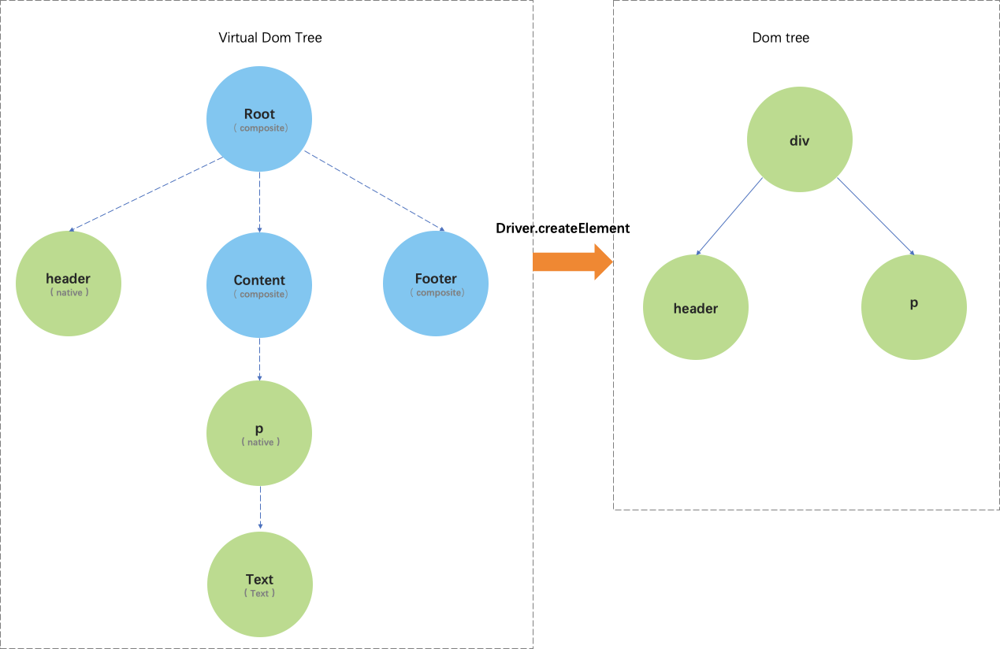

## 架构分层
Rax逻辑上可以分为三层：

- **rax**  
提供和宿主无关的对外API，其通过调用`rax-reconciler`来开启vdom的运转
    
    - createElement  
    - createContext
    - render
    - hooks
    - Component、PureComponent
    - ...
     

- **rax-reconciler**   
创建、维护、更新`vdom`，第一次挂载生成`vdom结构`，更新通过遍历`vdom结构`逐层比较props和state在更新、重建有区别的`子vdom`并生成patch（rax是边diff边patch），patch通过调用`driver`进行实际宿主环境的绘制

    在rax内部`vdom`就是是由以下几种类型的节点形成的树结构: 
            
    1.NativeComponent[源码](https://github.com/alibaba/rax/blob/master/packages/rax/src/vdom/native.js)         
    在`JSX`中返回的原生标签将生成一个NativeComponent实例节点,如`

`    
    
    2.CompositeComponent[源码](https://github.com/alibaba/rax/blob/master/packages/rax/src/vdom/composite.js)     
    继承Component、PureComponent的自定义组件、函数式组件将生成一个CompositeComponent实例节点,如 `<Header />`
       
    3.TextComponent[源码](https://github.com/alibaba/rax/blob/master/packages/rax/src/vdom/text.js)      
    纯文本节点将生成一个TextComponent实例节点,如 `Hellow World`   
    
    4.FragmentComponent[源码](https://github.com/alibaba/rax/blob/master/packages/rax/src/vdom/fragment.js)      
    JSX为`<></>`或`[]`将生成一个FragmentComponent实例节点   
    
    5.EmptyComponent[源码](https://github.com/alibaba/rax/blob/master/packages/rax/src/vdom/empty.js)      
    JSX为`null`、`undefined`、`true`、`false`时 将生成一个EmptyComponent实例节点，它主要用来占住当前位置，当下次更新成一个实际渲染节点时可以找到要挂载的index

- **driver**   
根据rax给出的关于UI操作的 增、删、改、查抽象，宿主进行实现从而实现真实绘制。如driver-dom就是调用dom api进行实际页面操作

## 执行流程
可以用Rax应用的三个流程完整分析完Rax所有能力，每个流程涉及以下知识点：

- 挂载流程
    - vdom是如何建立的
    - state、props、context的处理
    - ref
    - attribute
    - hooks 

- 更新流程
    - setState后rax干了什么
    - ref如何更新
    - attribute如何更新
    - hooks是如何实现的
    - SUC的注意点
    - key的作用、diff算法

- 卸载流程

来一张图一目了然，rax和driver维护了vdom和宿主环境"视图树"的关联，后续setState的操作就是通过**rax-reconciler** 操作vdom树并且产生diff最后

